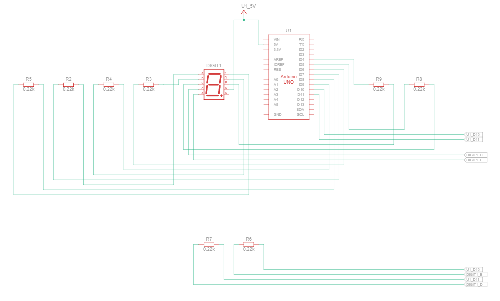

# Praktikum Sistem Tertanam - Modul 2A: Seven Segment
## Jawaban Pertanyaan Praktikum 
---
#### 1. Gambar rangkaian schematic pada percobaan 2A


#### 2. Apa yang terjadi jika nilai num lebih dari 15?
Jika `num` lebih dari 15, maka program akan mencoba mengakses index array `digitPattern` di luar batas yang telah ditentukan. Array tersebut hanya memiliki 16 elemen (index 0-15), shingga ketika melebihi batas, dapat terjadi kesalahan seperti tampilan yanh tidak sesuai atau bahkan perilaku tidak terduga (undefined behavior). 

#### 3. Apakah program ini menggunakan common cathode atau common anode? Jelaskan alasannya?
Program menggunakan konfigurasi common anode, karena pin common pada seven segment dihubungkan ke sumber tegangan (5V). Selain itu, pada kode program digunakan operator logika NOT (!) pada fungsi `digitalWrite()`, yang menunjukan bahwa logika output dibalik. Pada konfigurasi ini, segmen LED akan menyala ketika diberikan logika LOW dan akan mati ketika diberikan logika HIGH.

#### 4. Modifikasi program menjadi berjalan dari F ke 0
Modifikasi dilakukan pada fungsi `loop()` dengan mengubah arah perulangan pada fungsi `loop()`. Nilai awal diubah menjadi 15 karakter (karakter F) dan perulangan berjalan mundur hingga 0.
```cpp
void loop(){
  for (int i = 15; i >= 0; i--){
    displayDigit(i);
    delay(1000);
  }
}
```

Jika ditulis full:
```cpp
// #include <Arduino.h>
# inisialisasi pin arduino
const int segmentPins[8] = {7,6,5,11,10,8,9,4};

// inisialisasi digit pattern
byte digitPattern[16][8] = {
  {1,1,1,1,1,1,0,0},//0
  {0,1,1,0,0,0,0,0},//1
  {1,1,0,1,1,0,1,0},//2
  {1,1,1,1,0,0,1,0},//3
  {0,1,1,0,0,1,1,0},//4
  {1,0,1,1,0,1,1,0},//5
  {1,0,1,1,1,1,1,0},//6
  {1,1,1,0,0,0,0,0},//7
  {1,1,1,1,1,1,1,0},//8
  {1,1,1,1,0,1,1,0},//9
  {1,1,1,0,1,1,1,0},//A
  {0,0,1,1,1,1,1,0},//b
  {1,0,0,1,1,1,0,0},//C
  {0,1,1,1,1,0,1,0},//e
  {1,0,0,1,1,1,1,0},//E
  {1,0,0,0,1,1,1,0},//F
};

// menyalakan display 7 segmen
void displayDigit(int num){
  for(int i=0;i<8;i++){
    digitalWrite(segmentPins[i], !digitPattern[num][i]);
  }
}

# sutup insialisasi pin = output
void setup(){
  for(int i=0;i<8;i++){
    pinMode(segmentPins[i],OUTPUT);
  }
}

# fungsi loop untuk menjalankan seven segment yang menampilkan digit pattern secara berulang
void loop(){
  for (int i = 15; i >= 0; i--){
    displayDigit(i);
    delay(1000); // delay 
  }
}

```