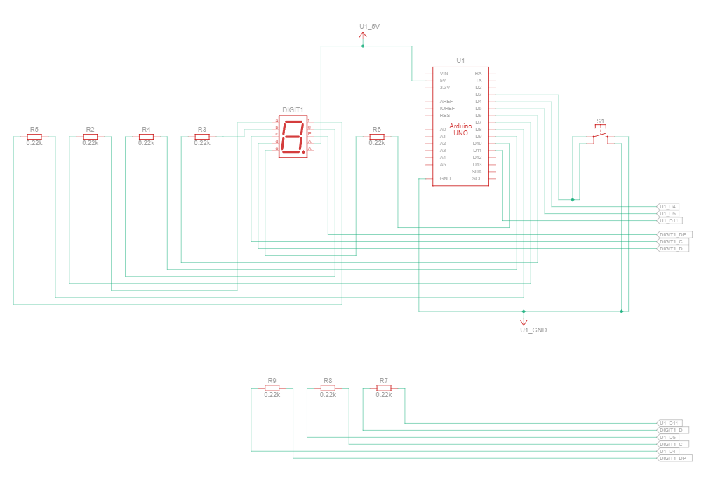
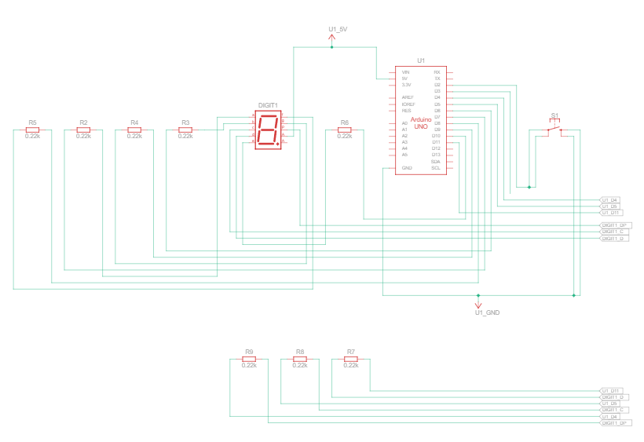

# Praktikum Sistem Tertanam - Modul 2B: Control Counter Push Button
## Jawaban Pertanyaan Praktikum 
---
#### 1. Gambar rangkaian schematic pada percobaan 2B 


#### 2. Mengapa pada push button digunakan mode `INPUT_PULLUP` pada Arduino Uno? Apa keuntungannya dibandingkan rangkaian biasa?
Mode `INPUT_PULLUP` digunakan untuk mengaktifkan resistor pull-up internal pada Arduino sehingga tidak diperlukan resistor eksternal tambahan. Dengan konfigurasi ini, pin input akan berada pada kondisi HIGH secara default dan berubah menjadi LOW ketika push button ditekan (terhubung ke GND).

Keuntungan pengguna `INPUT_PULLUP` dibandingkan rangkaian biasa adalah rangkaian menjadi lebih sederhana karena tidak memerlukan komponen tambahan, serta lebih stabil dalam membaca sinyal karena mengurangi kemungkinan noise atau kondisi floating pada pin input.

#### 3. Jika salah satu LED segmen tidak menyala, apa saja kemungkinan penyebabnya dari sisi hardware maupun software?
Jika salah satu segmen LED tidak menyala, terdapat beberapa kemungkinan penyebab, baik dari sisi hardware dan sisi software.
- Dari sisi hardware, ada kemungkinan disebabkan oleh kabel jumper yang tidak terhubung dengan baik, resistor yang rusak atau salah posisi penempatan, kesalahan wiring antara pin Arduino dan seven segmen, atau kerusakan pada LED Segmen itu sendiri
- Dari sisi software, ada kemungkinan disebabkan kesalahan saat penulisan array `digitPattern`, kesalahan dalam penentuan pin pada array `segmentPins`, atau kesalahan logika dalam pengaturan HIGH dan LOW. Kesalahan dalam penggunaan fungsi `digitalWrite()` juga dapat menyebabkan segmen tidak menyala.
#### 4. Modifikasi rangkaian dan program dengan dua push button yang berfungsi sebagai penambahan dan pengurangan pada sistem counter.

Berikut adalah gambar schematic dari modifikasi rangkaian 2B:  

Atau lebih jelas:
.png>)
- Ditambahkan 1 buah push button yang dihubungkan ke pin 2 Arduino untuk Up Button (Increement) dan 1 buah push button dihubungkan ke pin 3 Arduino untuk Down Button (Decreement)
- Inisialisasi button untuk btnUp dan btnDown.
- Pada fungsi loop tambahkan pengkondisiian, di mana ketika btnUp ditekan makan akan dilakukan increment dan ketika btnDown ditekan akan dilakukan decrement
Kode:
``` cpp
// #include <Arduino.h>
const int segmentPins[8] = {7,6,5,11,10,8,9,4};
const int btnUp = 2;
const int btnDown = 3;

byte digitPattern[16][8] = {
  {1,1,1,1,1,1,0,0},//0
  {0,1,1,0,0,0,0,0},//1
  {1,1,0,1,1,0,1,0},//2
  {1,1,1,1,0,0,1,0},//3
  {0,1,1,0,0,1,1,0},//4
  {1,0,1,1,0,1,1,0},//5
  {1,0,1,1,1,1,1,0},//6
  {1,1,1,0,0,0,0,0},//7
  {1,1,1,1,1,1,1,0},//8
  {1,1,1,1,0,1,1,0},//9
  {1,1,1,0,1,1,1,0},//A
  {0,0,1,1,1,1,1,0},//B
  {1,0,0,1,1,1,0,0},//C
  {0,1,1,1,1,0,1,0},//D
  {1,0,0,1,1,1,1,0},//E
  {1,0,0,0,1,1,1,0},//F
};

int currentDigit = 0;
bool lastUpState = HIGH;
bool lastDownState = HIGH;

void displayDigit(int num){
  for(int i=0;i<8;i++){
    digitalWrite(segmentPins[i], !digitPattern[num][i]);
  }
}

void setup(){
  for(int i=0;i<8;i++){
    pinMode(segmentPins[i],OUTPUT);
  }
  pinMode(btnUp, INPUT_PULLUP);
  pinMode(btnDown, INPUT_PULLUP);
  
  displayDigit(currentDigit);
}

void loop(){
  bool upState = digitalRead(btnUp);
  bool downState = digitalRead(btnDown);

  // Increment
  if(lastUpState == HIGH && upState == LOW){
    currentDigit++;
    if(currentDigit > 15) currentDigit = 0;
    displayDigit(currentDigit);
  }

  // Decrement
  if(lastDownState == HIGH && downState == LOW){
    currentDigit--;
    if(currentDigit < 0) currentDigit = 15;
    displayDigit(currentDigit);
  }

  lastUpState = upState;
  lastDownState = downState;
}
```


