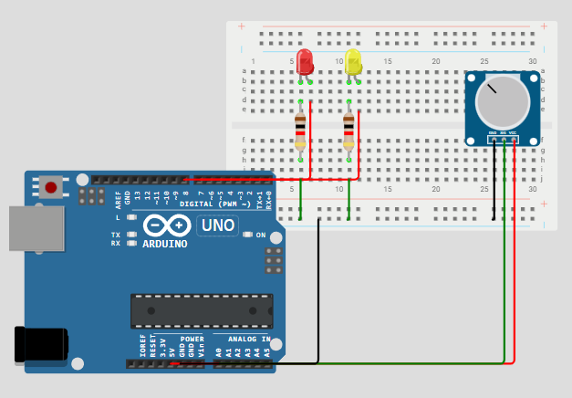

# Praktikum Sistem Tertanam - Modul 5A: Multitasking
## 5.6.4 Jawaban Pertanyaan Praktikum 
---
#### 1. Apakah ketiga task berjalan secara bersamaan atau bergantian? Jelaskan mekanismenya!
Ketiga task berjalan secara bergantian tetapi terlihat seperti berjalan bersamaan. FreeRTOS menggunakan scheduler untuk mengatur perpindahan eksekusi antar task dengan metode time slicing. Saat suatu task menjalankan vTaskDelay(), task tersebut akan ditunda sementara sehingga processor dapat menjalankan task lain. Dengan mekanisme ini, TaskBlink1, TaskBlink2, dan Taskprint dapat berjalan secara multitasking tanpa saling menghambat.

#### 2. Bagaimana cara menambahkan task keempat? Jelaskan langkahnya!
Cara membuat task ke-4:
- Buat fungsi task baru, misal task untuk ...
```cpp
void TaskBlink4(void *pvParameters) {
  pinMode(6, OUTPUT);
  while (1) {
    ...
  }
}
```
- Tambah xTaskCreate() pada fungsi setup():
```cpp
xTaskCreate(
  Task4,
  "task4",
  128,
  NULL,
  1,
  NULL
);
```
- Atur isi task sesuaii kebutuhan, misalnya menyalakan LED lain
```cpp
void TaskBlink4(void *pvParameters) {
  pinMode(6, OUTPUT);
  while (1) {
    digitalWrite(6, HIGH);
    vTaskDelay(400 / portTICK_PERIOD_MS);
    digitalWrite(6, LOW);
    vTaskDelay(400 / portTICK_PERIOD_MS);
  }
}
```
- Setelah scheduler dijalankan, task ke-4 akan berjalan secara multitasking bersama task lainnya

#### 3. Modifikasilah program dengan menambah sensor (misalnya potensiometer), lalu gunakan nilainya untuk mengontrol kecepatan LED! Bagaimana hasilnya? Jelaskan program pada file README.md.
Program dimodifikasi dengan menambahkan potensiometer pada pin analog A0. Nilai potensiometer dibaca menggunakan analogRead(), kemudian digunakan untuk mengatur delay kedipan LED. Semakin besar nilai potensiometer, maka delay LED semakin lama sehingga LED berkedip lebih lambat. Sebaliknya, jika nilai potensiometer kecil maka LED akan berkedip lebih cepat.

Wiring diagram:


Kode:
```cpp
#include <Arduino_FreeRTOS.h>
int potPin = A0;
void TaskBlink1(void *pvParameters);
void TaskBlink2(void *pvParameters);
void Taskprint(void *pvParameters);

void setup() {
  Serial.begin(9600);
  xTaskCreate(TaskBlink1, "task1", 128, NULL, 1, NULL);
  xTaskCreate(TaskBlink2, "task2", 128, NULL, 1, NULL);
  xTaskCreate(Taskprint, "task3", 128, NULL, 1, NULL);
  vTaskStartScheduler();
}

void loop() {
  // Kosong karena menggunakan FreeRTOS
}

//takses
void TaskBlink1(void *pvParameters) {
  pinMode(8, OUTPUT);
  int nilaiPot;
  int delayLED;
  while (1) {
    nilaiPot = analogRead(potPin);
    delayLED = map(nilaiPot, 0, 1023, 100, 1000);
    Serial.print("Pot = ");
    Serial.println(nilaiPot);
    digitalWrite(8, HIGH);
    vTaskDelay(delayLED / portTICK_PERIOD_MS);
    digitalWrite(8, LOW);
    vTaskDelay(delayLED / portTICK_PERIOD_MS);
  }
}
void TaskBlink2(void *pvParameters) {
  pinMode(7, OUTPUT);
  while (1) {
    Serial.println("Task2");
    digitalWrite(7, HIGH);
    vTaskDelay(300 / portTICK_PERIOD_MS);
    digitalWrite(7, LOW);
    vTaskDelay(300 / portTICK_PERIOD_MS);
  }
}
void Taskprint(void *pvParameters) {
  int counter = 0;
  while (1) {
    counter++;
    Serial.print("Counter = ");
    Serial.println(counter);
    vTaskDelay(500 / portTICK_PERIOD_MS);
  }
}
```
untuk simulasi dapat di akses pada link berikut: [Link Simulasi](https://wokwi.com/projects/463556099528427521)
Penjelasan per-line:
1. Import Library
```cpp
#include <Arduino_FreeRTOS>
```
untuk menjalankan multitasking pada arduino
2. Deklarasi Pin
```cpp
int potPin = A0;
```
mendeklarasikan pin analog A0 sebagai input potensiometer
3. deklarasi fungsi task
```cpp
void TaskBlink1(void *pvParameters);
void TaskBlink2(void *pvParameters);
void Taskprint(void *pvParameters);
```
Membuat prototipe fungsi task agar dapat dipanggil sebelum didefinisikan
4. Fungsi setup()
```cpp
void setup() {
    ... //isi setup
}
```
fungsi yang dijalankan satu kali saat arduino mulai aktif. pada fungsi ini dilakukan inisialisasi komunikasi serial, pembuatan task, dan menjalankan scheduler FreeRTOS
```cpp
  Serial.begin(9600);
```
memulai komunikasi serial dengan baud rate 9600bps agar data dapat ditampilkan pada serial monitor
```cpp
  xTaskCreate(TaskBlink1, "task1", 128, NULL, 1, NULL);
```
membuat task 1 yang berfungsi untuk mengontrol LED pada pin 8 menggunakan nilai potensiometer
```cpp
  xTaskCreate(TaskBlink2, "task2", 128, NULL, 1, NULL);
```
membuat task 2 yang berfungsi untuk mengontrol LED pada pin 7
```cpp
  xTaskCreate(Taskprint, "task3", 128, NULL, 1, NULL);
```
membuat task 3 yang berfungsi untuk menjalankan counter pada serial monitor
```cpp
  vTaskStartScheduler();
```
menjalankan scheduler FreeRTOS untuk mengatur eksekusi seluruh task secara multitasking
5. fungsi loop()
```cpp
void loop(){..}
```
fungsi loop kosong karena seluruh fungsi dijalankan oleh task FreeRTOS
6. TaskBlink1
```cpp
void TaskBlink1(void *pvParameters) {
  pinMode(8, OUTPUT); int nilaiPot; int delayLED;
  while (1) {
    nilaiPot = analogRead(potPin);
    delayLED = map(nilaiPot, 0, 1023, 100, 1000);
    Serial.print("Pot = ");
    Serial.println(nilaiPot);
    digitalWrite(8, HIGH);
    vTaskDelay(delayLED / portTICK_PERIOD_MS);
    digitalWrite(8, LOW);
    vTaskDelay(delayLED / portTICK_PERIOD_MS);
  }
}
```
- task 1 dibuat untuk mengontrol LED yang terhubung pada pin 8. pin 8 terlebih dahulu dideklarasikan sebagai output menggunakan `pinMode(8, OUTPUT)` agar dapat digunakan untuk menyalakan dan mematikan LED.
- variabel nilaipot digunakan untuk menyimpan hasil pembacaan nilai analog dari potensiometer pada pin A0, sedangkan variabel delayLED digunakan untuk menyimpan hasil konversi nilai potensiometer menjadi waktu delay LED.
- di dalam loop while(1), Arduino membaca nilai potensiometer menggunakan analogRead(potPin). Nilai ADC yang diperoleh berada pada rentang 0–1023, kemudian dikonversi menggunakan fungsi map() menjadi delay antara 100–1000 ms.
- nilai potensiometer ditampilkan pada Serial Monitor menggunakan Serial.print() dan Serial.println(). Selanjutnya LED pada pin 8 dinyalakan (HIGH) lalu diberi delay menggunakan vTaskDelay(), kemudian LED dimatikan (LOW) dan diberi delay kembali.
7. TaskBlink2
```cpp
void TaskBlink2(void *pvParameters) {
  pinMode(7, OUTPUT);
  while (1) {
    Serial.println("Task2");
    digitalWrite(7, HIGH);
    vTaskDelay(300 / portTICK_PERIOD_MS);
    digitalWrite(7, LOW);
    vTaskDelay(300 / portTICK_PERIOD_MS);
  }
}
```
- task 2 dibuat untuk mengontrol LED yang terhubung pada pin 7. Pin 7 terlebih dahulu diatur sebagai output menggunakan pinMode(7, OUTPUT).
- di dalam loop while(1), task akan menampilkan tulisan "Task2" pada Serial Monitor sebagai penanda bahwa task sedang berjalan. setelah itu LED pada pin 7 dinyalakan (HIGH) selama 300 ms menggunakan vTaskDelay(), kemudian dimatikan (LOW) selama 300 ms sebelum proses diulang kembali.
- task ini berjalan secara terus menerus dan independen dari task lainnya sehingga LED pada pin 7 dapat berkedip secara multitasking bersama task lain.
8. TaskBlink3
```cpp
void Taskprint(void *pvParameters) {
  int counter = 0;
  while (1) {
    counter++;
    Serial.print("Counter = ");
    Serial.println(counter);
    vTaskDelay(500 / portTICK_PERIOD_MS);
  }
}
```
- task 3 dibuat untuk menampilkan nilai counter pada Serial Monitor. Variabel counter diinisialisasi dengan nilai awal 0.
- di dalam loop while(1), nilai counter akan bertambah satu setiap kali loop dijalankan menggunakan counter++. Nilai counter kemudian ditampilkan pada Serial Monitor menggunakan Serial.print() dan Serial.println().
- setelah menampilkan nilai counter, task akan berhenti sementara selama 500 ms menggunakan vTaskDelay() sebelum mengulang proses kembali. Task ini berjalan bersamaan dengan task lainnya sehingga proses perhitungan counter dapat dilakukan secara multitasking.