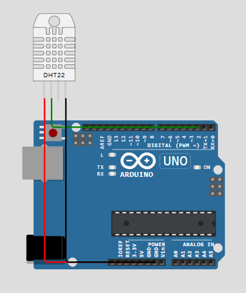

# Praktikum Sistem Tertanam - Modul 5B: Komunikasi Task
## 5.6.4 Jawaban Pertanyaan Praktikum 
---
#### 1. Apakah kedua task berjalan secara bersamaan atau bergantian? Jelaskan mekanismenya!
Kedua task berjalan secara multitasking atau bergantian sangat cepat sehingga terlihat seperti berjalan bersamaan. FreeRTOS menggunakan scheduler untuk mengatur pergantian eksekusi antar task.
- Task `read_data()` bertugas membaca dan mengirim data temperatur serta humidity ke queue menggunakan `xQueueSend()`. Sementara task `display()` bertugas menerima data dari queue menggunakan `xQueueReceive()` lalu menampilkannya pada Serial Monitor.
- Saat task `read_data()` menjalankan `vTaskDelay(100)`, task akan berada pada kondisi blocked sementara sehingga scheduler memberikan kesempatan kepada task `display()` untuk berjalan. Mekanisme inilah yang membuat kedua task dapat bekerja secara multitasking.

#### 2. Apakah program ini berpotensi mengalami race condition? Jelaskan!
Program ini tidak berpotensi mengalami race condition karena komunikasi data antar task dilakukan menggunakan queue FreeRTOS.
Queue berfungsi sebagai media komunikasi yang aman antar task sehingga data dikirim dan diterima secara teratur. Task `read_data() `hanya mengirim data ke queue menggunakan xQueueSend(), sedangkan task `display()` hanya menerima data menggunakan `xQueueReceive()`.
Karena kedua task tidak mengakses variabel global secara langsung pada waktu yang sama, maka konflik akses data atau race condition dapat dihindari. Selain itu, FreeRTOS juga telah mengatur sinkronisasi queue secara internal sehingga pertukaran data antar task menjadi lebih aman.

#### 3. Modifikasilah program dengan menggunakan sensor DHT sesungguhnya sehingga informasi yang ditampilkan dinamis. Bagaimana hasilnya? Jelaskan program pada file README.md.
Program dimodifikasi dengan menambahkan sensor DHT22 untuk membaca data temperatur dan kelembaban secara realtime. Sensor dihubungkan ke mikrokontroler menggunakan pin data digital sehingga nilai temperatur dan humidity dapat berubah secara dinamis sesuai kondisi sensor.  
Implementasi awal, simulasi menggunakan Arduino dan FreeRTOS di wokwi dengan schema diagram seperti berikut:
  
Namun, terdapat kendala pada pembacaam sensor DHT di Wokwi. Hal ini menyebabkan data pada serial monitor tidak dapat tampil dengan baik karena keterbatasan kompatibilitas simulator terhadap penggunaan FreeRTOS dan library DHT secara bersamaan pada Arduino Uno.  
Untuk mengatasi masalah tersebut, simulasi dipindahkan menggunakan ESP32. Program pada ESP32 menggunakan konsep dan mekanisme yang sama dengan Arduino Uno, yaitu multitasking menggunakan FreeRTOS dan komunikasi task menggunakan queue. Perbedaan utama terletak pada platform yang digunakan, dimana ESP32 memiliki dukungan FreeRTOS bawaan dan kapasitas memori yang lebih besar sehingga pembacaan sensor DHT dapat berjalan lebih stabil.  
Berikut kode program untuk implementasi penggunaan sensor DHT:
```cpp
#include <Arduino.h>
#include <DHT.h>
#define DHTPIN 4
#define DHTTYPE DHT22

DHT dht(DHTPIN, DHTTYPE);

struct readings {
  float temp;
  float hum;
};
QueueHandle_t my_queue;
void read_data(void *pvParameters);
void display_data(void *pvParameters);

void setup() {]
  Serial.begin(115200);
  dht.begin();
  Serial.println("Program Started");
  my_queue = xQueueCreate(5, sizeof(struct readings));

  if (my_queue == NULL) {
    Serial.println("Queue gagal dibuat!");
  } else {
    Serial.println("Queue berhasil dibuat");
  }
  xTaskCreate(read_data, "ReadData", 2048, NULL, 1, NULL );
  xTaskCreate(display_data, "DisplayData", 2048, NULL, 1, NULL);

  Serial.println("Task berhasil dibuat");
}
void loop() {
  // Kosong karena menggunakan FreeRTOS
}

void read_data(void *pvParameters) {
  struct readings data;
  for (;;) {
    data.temp = dht.readTemperature();
    data.hum = dht.readHumidity();

    if (!isnan(data.temp) && !isnan(data.hum)) {
      xQueueSend(my_queue, &data, portMAX_DELAY);
    }
    vTaskDelay(2000 / portTICK_PERIOD_MS);
  }
}
void display_data(void *pvParameters) {
  struct readings data;
  for (;;) {
    if (xQueueReceive(my_queue, &data, portMAX_DELAY) == pdPASS) {
      Serial.print("Temperature = ");
      Serial.print(data.temp);
      Serial.println(" C");
      Serial.print("Humidity = ");
      Serial.print(data.hum);
      Serial.println(" %");
      Serial.println("----------------------");
    }
  }
}
```
Program bekerjada dengan 2 task utama, yaitu `read_data()` untuk membaca data dari sensor DHT lalu mengirimkannya ke queue menggunakan `xQueueSend()` dan `display_data()`  bertugas menerima data dari queue menggunakan `xQueueReceive()` kemudian menampilkan hasil pembacaan sensor pada serial monitor. Penjelasan kode perbaris sebagai berikut:
1. Import Library
```cpp
#include <Arduino.h>
#include <DHT.h>
```
Arduino.h digunakan untuk mengakses fungsi dasar Arduino seperti pinMode(), digitalWrite(), Serial, dan fungsi lainnya.
DHT.h digunakan untuk mengakses sensor DHT22 agar dapat membaca data temperatur dan kelembaban.  
2. Konfigurasi DHT
```cpp
#define DHTPIN 4
#define DHTTYPE DHT22

DHT dht(DHTPIN, DHTTYPE);
```
DHTPIN menentukan pin data sensor DHT yang digunakan, yaitu GPIO 4 pada ESP32. DHTTYPE menentukan jenis sensor yang digunakan, yaitu DHT22. Kemudian DHT dideklarasikan sebagai objek dengan nama dht menggunakan pin dan tipe sensor yang telah ditentukan.
3. Struct Data
```cpp
struct readings {
  float temp;
  float hum;
};
```
Struct readings digunakan untuk menyimpan dua data sensor sekaligus, yaitu temp untuk temperatur dan hum untuk kelembaban. Tipe data float digunakan karena hasil pembacaan sensor berupa bilangan desimal.
4. Queue
```cpp
QueueHandle_t my_queue;
```
Mendeklarasikan queue FreeRTOS bernama my_queue yang digunakan sebagai media komunikasi antar task.
5. Fungsi Prototype
```cpp
void read_data(void *pvParameters);
void display_data(void *pvParameters);
```
Membuat prototipe fungsi task agar fungsi dapat dipanggil sebelum didefinisikan.
6. Fungsi setup()
```cpp
void setup() {]
  Serial.begin(115200);
  dht.begin();
  Serial.println("Program Started");
  my_queue = xQueueCreate(5, sizeof(struct readings));

  if (my_queue == NULL) {
    Serial.println("Queue gagal dibuat!");
  } else {
    Serial.println("Queue berhasil dibuat");
  }
  xTaskCreate(read_data, "ReadData", 2048, NULL, 1, NULL );
  xTaskCreate(display_data, "DisplayData", 2048, NULL, 1, NULL);

  Serial.println("Task berhasil dibuat");
}
```
Fungsi setup ini dijalankan satu kali saat ESP32 mulai aktif. Pada fungsi setup, dilakukan ... (lanjutin bg) 
7. Fungsi loop()
```cpp
void loop(){}
```
8. Fungsi read_data()
```cpp
void read_data(void *pvParameters) {
  struct readings data;
  for (;;) {
    data.temp = dht.readTemperature();
    data.hum = dht.readHumidity();

    if (!isnan(data.temp) && !isnan(data.hum)) {
      xQueueSend(my_queue, &data, portMAX_DELAY);
    }
    vTaskDelay(2000 / portTICK_PERIOD_MS);
  }
}
```
9. Fungsi display_data()
```cpp
void display_data(void *pvParameters) {
  struct readings data;
  for (;;) {
    if (xQueueReceive(my_queue, &data, portMAX_DELAY) == pdPASS) {
      Serial.print("Temperature = ");
      Serial.print(data.temp);
      Serial.println(" C");
      Serial.print("Humidity = ");
      Serial.print(data.hum);
      Serial.println(" %");
      Serial.println("----------------------");
    }
  }
}
```